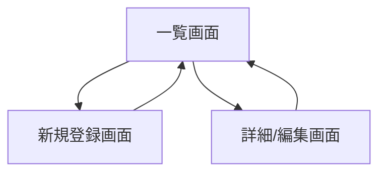

# FC25 Nuxt3 Tools システム設計書

## 1. システム概要

### 1.1 プロジェクトの目的
FC25の対戦データ管理や便利なツールを提供するWebアプリケーション。
Nuxt3 + Node.jsの学習目的も兼ねており、段階的に機能を拡張していく。

### 1.2 システム構成
- フロントエンド: Nuxt.js 3
- バックエンド: Node.js v18系 (Express)
- データベース: MySQL
- スタイリング: Tailwind CSS v4.00
- 開発言語: TypeScript
- 使用ライブラリ:
  - @iconify/vue（アイコン）

## 2. 機能要件

### 2.1 対戦データ管理機能
#### 2.1.1 対戦データ一覧表示
- 登録された対戦データを一覧形式で表示
- ソート機能
- フィルター機能

#### 2.1.2 対戦データ登録
- 新規ボタンからデータ登録画面へ遷移
- 必要項目の入力フォーム
- バリデーション機能

#### 2.1.3 対戦データ編集
- 一覧から詳細画面への遷移
- データの編集機能
- 削除機能

### 2.2 今後の拡張機能（予定）
- （追加予定の機能をここに記載）

## 3. 画面設計

### 3.1 画面一覧
1. 対戦データ一覧画面
2. 対戦データ登録画面
3. 対戦データ詳細/編集画面

### 3.2 画面遷移図


## 4. データモデル設計

### 4.1 データベーステーブル構成
```sql
-- 大会（CF）テーブル
CREATE TABLE tournaments (
    id VARCHAR(36) PRIMARY KEY,
    name VARCHAR(100) NOT NULL,
    start_date DATE NOT NULL,          -- 大会開始日
    comment TEXT,                      -- 大会全体のコメント
    mvp_player_id VARCHAR(36),         -- MVP選手ID
    FOREIGN KEY (mvp_player_id) REFERENCES tournament_players(id),
    created_at DATETIME NOT NULL DEFAULT CURRENT_TIMESTAMP,
    updated_at DATETIME NOT NULL DEFAULT CURRENT_TIMESTAMP ON UPDATE CURRENT_TIMESTAMP
);

-- 大会選手テーブル
CREATE TABLE tournament_players (
    id VARCHAR(36) PRIMARY KEY,
    tournament_id VARCHAR(36) NOT NULL,
    name VARCHAR(100) NOT NULL,
    position ENUM('GK', 'DF', 'MF', 'FW') NOT NULL,
    team VARCHAR(100) NOT NULL,
    goals INT NOT NULL DEFAULT 0,      -- 大会での総得点
    assists INT NOT NULL DEFAULT 0,     -- 大会での総アシスト
    is_starter BOOLEAN NOT NULL DEFAULT false,
    FOREIGN KEY (tournament_id) REFERENCES tournaments(id),
    created_at DATETIME NOT NULL DEFAULT CURRENT_TIMESTAMP,
    updated_at DATETIME NOT NULL DEFAULT CURRENT_TIMESTAMP ON UPDATE CURRENT_TIMESTAMP,
    UNIQUE KEY `unique_tournament_player` (tournament_id, name)
);

-- 試合テーブル
CREATE TABLE matches (
    id VARCHAR(36) PRIMARY KEY,
    tournament_id VARCHAR(36) NOT NULL,
    match_date DATETIME NOT NULL,
    opponent VARCHAR(100) NOT NULL,
    result ENUM('win', 'lose', 'draw') NOT NULL,
    score_for INT NOT NULL DEFAULT 0,
    score_against INT NOT NULL DEFAULT 0,
    FOREIGN KEY (tournament_id) REFERENCES tournaments(id),
    created_at DATETIME NOT NULL DEFAULT CURRENT_TIMESTAMP,
    updated_at DATETIME NOT NULL DEFAULT CURRENT_TIMESTAMP ON UPDATE CURRENT_TIMESTAMP
);

-- 試合選手成績テーブル
CREATE TABLE match_performances (
    id VARCHAR(36) PRIMARY KEY,
    match_id VARCHAR(36) NOT NULL,
    player_id VARCHAR(36) NOT NULL,
    goals INT NOT NULL DEFAULT 0,
    assists INT NOT NULL DEFAULT 0,
    played_as_starter BOOLEAN NOT NULL DEFAULT false,
    FOREIGN KEY (match_id) REFERENCES matches(id),
    FOREIGN KEY (player_id) REFERENCES tournament_players(id),
    created_at DATETIME NOT NULL DEFAULT CURRENT_TIMESTAMP,
    updated_at DATETIME NOT NULL DEFAULT CURRENT_TIMESTAMP ON UPDATE CURRENT_TIMESTAMP,
    UNIQUE KEY `unique_match_player` (match_id, player_id)  -- 同一試合での選手の重複を防ぐ
);
```

### 4.2 TypeScriptインターフェース
```typescript
// 大会データ
interface Tournament {
  id: string;
  name: string;
  startDate: Date;
  comment?: string;        // 大会コメント
  mvpPlayerId?: string;    // MVP選手ID
  mvpPlayer?: TournamentPlayer;  // MVP選手情報
  players: TournamentPlayer[];
  matches: Match[];
  createdAt: Date;
  updatedAt: Date;
}

// ポジション定義
type Position = 'GK' | 'DF' | 'MF' | 'FW';

// 大会選手データ
interface TournamentPlayer {
  id: string;
  tournamentId: string;
  name: string;
  position: Position;  // 型を限定
  team: string;
  goals: number;
  assists: number;
  isStarter: boolean;
  createdAt: Date;
  updatedAt: Date;
}

// 試合データ
interface Match {
  id: string;
  tournamentId: string;
  matchDate: Date;
  opponent: string;
  result: 'win' | 'lose' | 'draw';
  scoreFor: number;
  scoreAgainst: number;
  comment?: string;
  performances: MatchPerformance[];
  createdAt: Date;
  updatedAt: Date;
}

// 試合選手成績データ
interface MatchPerformance {
  id: string;
  matchId: string;
  playerId: string;
  goals: number;
  assists: number;
  playedAsStarter: boolean;
  player: TournamentPlayer;  // 関連する選手データ
  createdAt: Date;
  updatedAt: Date;
}
```

### 4.3 バリデーションルール
- 大会登録時：
  - 大会名: 必須
  - 開始日: 必須
  - MVP: 任意（登録済みの選手のみ選択可）
  - コメント: 任意

- 大会選手登録時：
  - 名前: 必須（同一大会内で重複不可）
  - ポジション: 必須（GK/DF/MF/FWのいずれか）
  - チーム: 必須

- 試合登録時：
  - 試合日時: 必須
  - 対戦相手: 必須
  - 勝敗: 必須（win/lose/drawのいずれか）
  - スコア: 0以上の整数

- 選手成績登録時：
  - 得点: 0以上の整数
  - アシスト: 0以上の整数

## 5. API設計

### 5.1 エンドポイント一覧
- GET /api/tournaments - 大会一覧取得
- POST /api/tournaments - 大会登録
- GET /api/tournaments/:id - 大会詳細取得
- PUT /api/tournaments/:id - 大会情報更新（選手、MVP、コメントを含む）
- GET /api/tournaments/:id/matches - 大会試合一覧取得
- POST /api/tournaments/:id/matches - 大会試合登録
- GET /api/matches/:id - 試合詳細取得
- PUT /api/matches/:id - 試合情報更新（選手成績を含む）

### 5.2 リクエスト/レスポンス例
```typescript
// 大会更新リクエスト
interface UpdateTournamentRequest {
  name: string;
  startDate: string;  // ISO 8601形式
  comment?: string;
  mvpPlayerId?: string;
  players: {
    id?: string;      // 既存選手の場合はID必須
    name: string;
    position: 'GK' | 'DF' | 'MF' | 'FW';
    team: string;
    isStarter: boolean;
  }[];
}

// 試合更新リクエスト
interface UpdateMatchRequest {
  matchDate: string;  // ISO 8601形式
  opponent: string;
  result: 'win' | 'lose' | 'draw';
  scoreFor: number;
  scoreAgainst: number;
  performances: {
    playerId: string;
    goals: number;
    assists: number;
    playedAsStarter: boolean;
  }[];
}

// 大会詳細レスポンス
interface TournamentResponse {
  id: string;
  name: string;
  startDate: string;  // ISO 8601形式
  comment?: string;
  mvpPlayer?: {
    id: string;
    name: string;
    position: string;
    team: string;
    goals: number;
    assists: number;
  };
  players: {
    id: string;
    name: string;
    position: string;
    team: string;
    goals: number;
    assists: number;
    isStarter: boolean;
  }[];
  matches: {
    id: string;
    matchDate: string;
    opponent: string;
    result: 'win' | 'lose' | 'draw';
    scoreFor: number;
    scoreAgainst: number;
    performances: {
      playerId: string;
      goals: number;
      assists: number;
      playedAsStarter: boolean;
    }[];
  }[];
  createdAt: string;
  updatedAt: string;
}
```

## 6. 非機能要件

### 6.1 パフォーマンス要件
- ページロード時間: 3秒以内
- API レスポンス時間: 1秒以内

### 6.2 セキュリティ要件
- XSS対策
- CSRF対策
- 入力値のバリデーション

### 6.3 ブラウザ対応
- モダンブラウザ（Chrome、Firefox、Safari、Edge）の最新版

## 7. 開発環境・運用環境

### 7.1 開発環境
- Node.js v18系
- TypeScript
- Git/GitHub
- VSCode推奨

### 7.2 デプロイメント
- （検討中） 