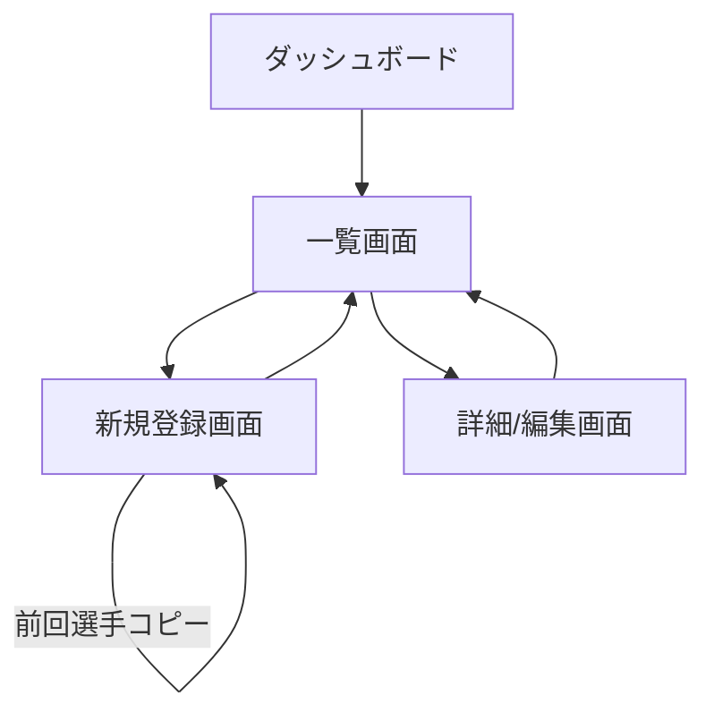

# FC25 Nuxt3 Tools システム設計書

## 1. システム概要

### 1.1 プロジェクトの目的

FC25 の対戦データ管理や便利なツールを提供する Web アプリケーション。
Nuxt3 + Node.js の学習目的も兼ねており、段階的に機能を拡張していく。

### 1.2 システム構成

- フロントエンド: Nuxt.js 3
- バックエンド: Node.js v18 系 (Express)
- データベース: MySQL
- スタイリング: Tailwind CSS v4.00
- 開発言語: TypeScript
- 使用ライブラリ:
  - @iconify/vue（アイコン）

## 2. 機能要件

### 2.1 対戦データ管理機能

#### 2.1.1 対戦データ一覧表示

- 登録された対戦データを一覧形式で表示
- 日付による昇順/降順ソート機能
- 上位3名の得点者/アシスト提供者の表示
- 大会の勝率表示
- MVP選手の表示
- 大会の状態表示（進行中/終了）

#### 2.1.2 対戦データ登録

- 新規ボタンからデータ登録画面へ遷移
- 必要項目の入力フォーム
- バリデーション機能
- 前回の選手データコピー機能
- 選手の自動整頓機能（ポジション、スターター状態による並び替え）

#### 2.1.3 対戦データ編集

- 一覧から詳細画面への遷移
- データの編集機能（大会終了前のみ）
- 削除機能
- 大会終了の自動判定（開始日から4日後）

### 2.2 今後の拡張機能（予定）

- 試合データの詳細管理
- 選手統計機能
- チーム分析機能

## 3. 画面設計

### 3.1 画面一覧

1. 対戦データ一覧画面
   - 日付ソート機能
   - 大会状態表示
   - 得点/アシスト上位表示
2. 対戦データ登録画面
   - 前回選手コピー機能
   - 選手整頓機能
3. 対戦データ詳細/編集画面
   - 大会終了判定による編集制御
   - MVP選手選択

### 3.2 画面遷移図



## 4. データモデル設計

### 4.1 データベーステーブル構成と関連

#### テーブル構成の概要

1. **tournaments（大会）テーブル**
   - 大会の基本情報を管理
   - ID は VARCHAR(36)形式で、UUID を使用
   - 勝敗数は集計値として保持（wins, losses）
   - MVP プレイヤーは選手テーブルを参照
   - 開始日から4日後を大会終了日として扱う

2. **players（選手）テーブル**
   - 大会に紐づく選手情報を管理
   - ID は VARCHAR(36)形式で、UUID を使用
   - 得点・アシストは集計値として保持
   - 同一大会内での選手名の重複を防止

#### テーブル間の関連

1. **tournaments ⇔ players の関連**

   - players.tournament_id → tournaments.id （多対 1 の関係）
   - 1 つの大会に複数の選手が所属
   - 外部キー制約により、存在する大会のみに選手を登録可能

2. **tournaments ⇔ players の MVP 関連**
   - tournaments.mvp_player_id → players.id （1 対 1 の関係）
   - 大会の MVP として選手を指定可能
   - 循環参照を避けるため、ALTER TABLE で制約を追加

#### テーブル定義

```sql
-- 大会（CF）テーブル
CREATE TABLE tournaments (
    id VARCHAR(36) PRIMARY KEY,
    start_date DATE NOT NULL,          -- 大会開始日
    comment TEXT,                      -- 大会全体のコメント
    wins INT NOT NULL DEFAULT 0,       -- 大会全体の勝ち
    losses INT NOT NULL DEFAULT 0,       -- 大会全体の負け
    mvp_player_id VARCHAR(36),         -- MVP選手ID
    created_at DATETIME NOT NULL DEFAULT CURRENT_TIMESTAMP,
    updated_at DATETIME NOT NULL DEFAULT CURRENT_TIMESTAMP ON UPDATE CURRENT_TIMESTAMP
);

-- 選手テーブル
CREATE TABLE players (
    id VARCHAR(36) PRIMARY KEY,
    tournament_id VARCHAR(36) NOT NULL,
    name VARCHAR(255) NOT NULL,
    position ENUM('GK', 'DF', 'MF', 'FW') NOT NULL, -- ポジション
    team VARCHAR(255) NOT NULL,        -- 所属チーム
    is_starter BOOLEAN NOT NULL DEFAULT false, -- スタメンかベンチか
    total_goals INT NOT NULL DEFAULT 0,      -- 大会での総得点
    total_assists INT NOT NULL DEFAULT 0,     -- 大会での総アシスト
    created_at DATETIME NOT NULL DEFAULT CURRENT_TIMESTAMP,
    updated_at DATETIME NOT NULL DEFAULT CURRENT_TIMESTAMP ON UPDATE CURRENT_TIMESTAMP,
    FOREIGN KEY (tournament_id) REFERENCES tournaments(id),
    UNIQUE KEY `unique_tournament_player` (tournament_id, name)
);

-- MVPの外部キー制約を追加
ALTER TABLE tournaments
    ADD CONSTRAINT fk_mvp_player
    FOREIGN KEY (mvp_player_id) REFERENCES players(id);

```

#### 特記事項

1. **ID 管理**

   - すべての ID カラムで VARCHAR(36)を採用（UUID 形式）
   - システムの拡張性とデータの一意性を確保

2. **データの整合性**

   - 外部キー制約による参照整合性の確保
   - ユニーク制約による重複データの防止
   - デフォルト値の適切な設定

3. **監査証跡**

   - 作成日時（created_at）と更新日時（updated_at）を自動管理
   - データの変更履歴を追跡可能

4. **パフォーマンス考慮**
   - 得点、アシスト、勝敗数を集計値として保持
   - 頻繁な集計処理を回避

### 4.2 TypeScript インターフェース

```typescript
// 大会データ
interface Tournament {
    tournamentId: string;
    startDate: string; // 開始日
    wins: number; // 勝ち数
    losses: number; // 負け数
    mvpPlayerId?: string; // MVP選手ID
    comment?: string;
    players: Player[];
    createdAt: string;
    updatedAt: string;
}

// ポジション定義
type Position = 'GK' | 'DF' | 'MF' | 'FW';

// 大会選手データ
interface Player {
    id: string;
    tournamentId: string;
    name: string;
    position: Position;
    team: string;
    totalGoals: number;
    totalAssists: number;
    isStarter: boolean;
    createdAt: string;
    updatedAt: string;
}
```

### 4.3 バリデーションルール

- 大会登録時：
  - 開始日:
    - 必須
    - 今日以降の日付のみ選択可能
    - YYYY-MM-DD 形式で保存
  - コメント: 任意
  - 選手登録（18 名必須）:
    - 名前:
      - 必須
      - 同一大会内で重複不可
    - ポジション:
      - 必須（GK/DF/MF/FW のいずれか）
      - スターティングメンバー（11 名）の構成:
        - GK: 1 名
        - DF: 4 名
        - MF: 3 名
        - FW: 3 名
    - チーム: 必須
    - スターター:
      - 必須（true/false）
      - スターティングメンバー 11 名、ベンチ 7 名の構成
  - MVP:
    - 任意
    - 登録済みの選手のみ選択可
    - 大会終了後に設定可能

- 大会編集時：
  - 開始日から4日後以降は編集不可
  - 大会終了後はMVP選手の設定のみ可能

## 5. API 設計

### 5.1 エンドポイント一覧

- GET /api/tournaments - 大会一覧取得
- POST /api/tournaments - 大会登録
- GET /api/tournaments/:id - 大会詳細取得
- PUT /api/tournaments/:id - 大会情報更新（選手、MVP、コメントを含む）
- GET /api/tournaments/:id/matches - 大会試合一覧取得
- POST /api/tournaments/:id/matches - 大会試合登録
- GET /api/matches/:id - 試合詳細取得
- PUT /api/matches/:id - 試合情報更新（選手成績を含む）
- GET /api/tournaments/latest/players - 最新の大会の選手情報取得

### 5.2 リクエスト/レスポンス例

```typescript
// 大会更新リクエスト
interface UpdateTournamentRequest {
    name: string;
    startDate: string; // ISO 8601形式
    comment?: string;
    mvpPlayerId?: string;
    players: {
        id?: string; // 既存選手の場合はID必須
        name: string;
        position: 'GK' | 'DF' | 'MF' | 'FW';
        team: string;
        isStarter: boolean;
    }[];
}

// 試合更新リクエスト
interface UpdateMatchRequest {
    matchDate: string; // ISO 8601形式
    opponent: string;
    result: 'win' | 'lose' | 'draw';
    scoreFor: number;
    scoreAgainst: number;
    performances: {
        playerId: string;
        goals: number;
        assists: number;
        playedAsStarter: boolean;
    }[];
}

// 大会詳細レスポンス
interface TournamentResponse {
    id: string;
    name: string;
    startDate: string; // ISO 8601形式
    comment?: string;
    mvpPlayer?: {
        id: string;
        name: string;
        position: string;
        team: string;
        goals: number;
        assists: number;
    };
    players: {
        id: string;
        name: string;
        position: string;
        team: string;
        goals: number;
        assists: number;
        isStarter: boolean;
    }[];
    matches: {
        id: string;
        matchDate: string;
        opponent: string;
        result: 'win' | 'lose' | 'draw';
        scoreFor: number;
        scoreAgainst: number;
        performances: {
            playerId: string;
            goals: number;
            assists: number;
            playedAsStarter: boolean;
        }[];
    }[];
    createdAt: string;
    updatedAt: string;
}

// 最新選手情報レスポンス
interface LatestPlayersResponse {
    players: {
        name: string;
        position: Position;
        team: string;
        isStarter: boolean;
    }[];
}
```

## 6. 非機能要件

### 6.1 パフォーマンス要件

- ページロード時間: 3 秒以内
- API レスポンス時間: 1 秒以内

### 6.2 セキュリティ要件

- XSS 対策
- CSRF 対策
- 入力値のバリデーション

### 6.3 ブラウザ対応

- モダンブラウザ（Chrome、Firefox、Safari、Edge）の最新版

## 7. 開発環境・運用環境

### 7.1 開発環境

- Node.js v18 系
- TypeScript
- Git/GitHub
- VSCode 推奨

### 7.2 デプロイメント

- （検討中）
